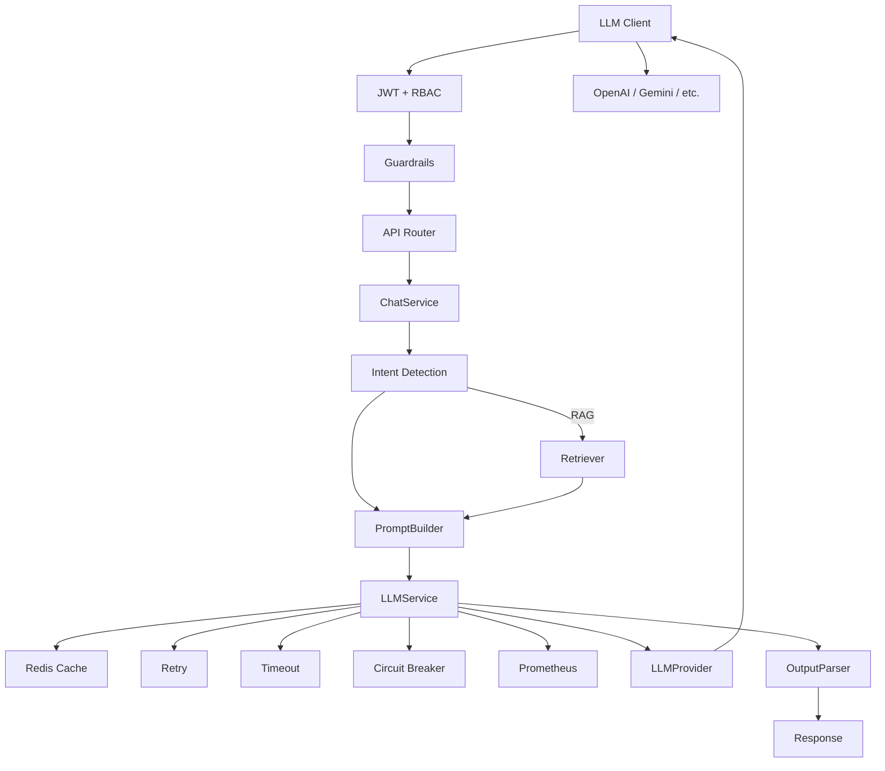

# Enterprise LLM Platform — Interview Learning Guide

Use this to explain the project confidently in a Senior LLMOps / Backend interview. Study it in order: **big picture → request flow → layers → design tradeoffs → demo → Q&A**.

---

## 1. Your 60-Second Elevator Pitch

> "I built a production-style Enterprise LLM Platform in Python 3.12 and FastAPI. It's not a demo chatbot — it follows Clean Architecture with strict layering: routers validate and delegate, services own business logic, providers abstract LLMs, and clients wrap SDKs.
>
> It supports multiple providers through a registry pattern, RAG with Qdrant, Redis caching, retry/timeout/circuit breaker policies, JWT + RBAC, prompt guardrails, SSE streaming, an agent framework with tools, Prometheus metrics, and Kubernetes deployment manifests. Everything is wired with dependency injection and tested to 80%+ coverage."

That framing positions you as an **engineer**, not someone who glued LangChain together.

---

## 2. Mental Model — Learn This First



**Three rules to memorize:**

| Rule | Meaning |
|------|---------|
| Routers are thin | No business logic in `app/api/` |
| Services orchestrate | `ChatService`, `LLMService` coordinate behavior |
| SDKs never leak up | Only `app/clients/` talks to external SDKs |

---

## 3. Study Order (2–3 Days)

### Day 1 — Foundation

Read in this order:

1. `app/core/config.py` — all settings from env
2. `app/dependencies.py` — how everything is wired
3. `app/main.py` — app bootstrap, middleware, routers
4. `app/api/chat.py` — thin router pattern
5. `app/services/chat_service.py` — real business logic
6. `app/services/llm_service.py` — policies + metrics + cache

### Day 2 — LLM + RAG

7. `app/providers/llm_provider.py` + `registry.py`
8. `app/providers/openai_provider.py` + `app/clients/openai_client.py`
9. `app/retrieval/retriever.py` — hybrid search + reranker
10. `app/services/ingestion_service.py` — PDF → chunks → embeddings → Qdrant
11. `app/prompt/prompt_builder.py`
12. `app/parser/output_parser.py`

### Day 3 — Production + Agents

13. `app/security/authentication.py` + `guardrails.py`
14. `app/policies/retry.py` — retry, timeout, circuit breaker
15. `app/cache/redis_cache.py`
16. `app/agents/agent_service.py` — planner/executor loop
17. `app/observability/metrics.py`
18. `k8s/deployment.yaml`, `docker-compose.yml`, `.github/workflows/ci.yml`
19. `tests/` — how mocking and DI overrides work

---

## 4. Layer-by-Layer — What to Say in Interviews

### API Layer (`app/api/`)

**Purpose:** HTTP boundary only.

| File | Endpoint | Your talking point |
|------|----------|-------------------|
| `health.py` | `/health`, `/live`, `/ready` | Liveness vs readiness; readiness checks Redis + Qdrant |
| `auth.py` | `POST /api/v1/auth/token` | Dev JWT issuance |
| `chat.py` | `/api/v1/chat`, `/chat/stream` | Sync + SSE streaming |
| `documents.py` | `/documents/ingest` | PDF upload → vector store |
| `agents.py` | `/agents/run` | Agent goal execution |

**Interview line:**

*"Routers validate Pydantic models, resolve dependencies, call one service method, and return a response model. That keeps HTTP concerns separate from domain logic."*

---

### Services (`app/services/`)

#### `ChatService` — business orchestration

Responsibilities:

- Guardrail validation
- Intent detection (`search`, `document` → RAG)
- Optional retrieval
- Prompt building
- Delegation to `LLMService`
- Session memory
- Token/cost passthrough

Key file: `app/services/chat_service.py`

#### `LLMService` — infrastructure orchestration

Responsibilities:

- Cache lookup/store
- Retry + timeout + circuit breaker
- Provider delegation
- Token counting + cost estimation
- Prometheus metrics
- Streaming

Key file: `app/services/llm_service.py`

**Interview line:**

*"ChatService knows WHAT to do (RAG, guardrails, sessions). LLMService knows HOW to call an LLM reliably in production."*

That split is a strong Senior-level answer.

---

### Providers vs Clients

| Layer | Responsibility | Example |
|-------|----------------|---------|
| **Client** | Raw SDK communication only | `OpenAIClient.generate()` |
| **Provider** | Normalize to `LLMResult`, implement `LLMProvider` | `OpenAIProvider` |
| **Registry** | Factory — no if/else chains | `ProviderRegistry.create("gemini")` |

**Why this matters:**

Adding Azure OpenAI = new client + new provider + register in registry. No changes to `ChatService` or `LLMService`. That's **Open/Closed Principle**.

---

### RAG Pipeline

```
PDF upload
  → RecursiveTextSplitter (chunk_size, overlap)
  → OpenAI embeddings
  → Qdrant upsert with metadata
  → stored in DocumentRepository (metadata)

Chat question
  → embed question
  → Qdrant vector search (top-K)
  → HybridSearch (vector + lexical overlap)
  → Reranker (top-N)
  → PromptBuilder injects context
  → LLM generates answer with sources
```

**Key terms to use:**

- **Top-K** = retrieve many candidates (default 5)
- **Top-N** = rerank and keep best (default 3)
- **Hybrid search** = semantic + keyword overlap
- **Metadata filter** = scoped retrieval per collection/tags

---

### Policies (`app/policies/`)

| Policy | Purpose | When it fires |
|--------|---------|---------------|
| **RetryPolicy** | Transient failures | Exponential backoff, max 3 attempts |
| **TimeoutPolicy** | Hung requests | `asyncio.wait_for` |
| **CircuitBreaker** | Cascading failures | Opens after N failures, resets after timeout |

**Interview question:** *"Why circuit breaker AND retry?"*

**Answer:** Retry handles transient blips. Circuit breaker stops hammering a dead dependency and gives it time to recover — protects your API and downstream bills.

---

### Cache (`app/cache/`)

- **Semantic cache interface** — abstraction over Redis
- **Cache key** — SHA-256 of `{provider, model, prompt}`
- **TTL** — configurable via `CACHE_TTL_SECONDS`
- **Graceful degradation** — if Redis is down, requests still work

**Interview line:**

*"Cache is in LLMService, not the provider, so all providers benefit uniformly and cache logic isn't duplicated."*

---

### Security (`app/security/`)

| Feature | Implementation |
|---------|----------------|
| JWT auth | `python-jose`, bearer tokens |
| RBAC | `admin`, `user`, `viewer` roles |
| Guardrails | Regex-based prompt injection detection |
| Rate limiting | In-memory middleware per client IP |
| Secrets | `pydantic-settings` from `.env` |

Protected endpoints use `require_auth_permission("chat")` etc.

---

### Agents (`app/agents/`)

```
Goal
  → Planner (LLM plans next step as JSON)
  → Executor (runs tool or finishes)
  → ToolRouter (weather, sql, kubernetes, shell)
  → Observation added to history
  → Loop until finish or max_iterations
```

**Interview line:**

*"This is a ReAct-style loop: plan → act → observe. The planner is LLM-driven; execution is deterministic through a tool registry."*

---

### Observability

| Signal | Where |
|--------|-------|
| Request ID | `RequestIDMiddleware` → `X-Request-ID` header |
| Structured logs | `app/observability/logger.py` |
| Metrics | Prometheus counters/histograms at `/metrics` |
| Health | `/health` (liveness), `/ready` (dependency checks) |

Metrics tracked: request count, latency, tokens, cost, cache hits/misses.

---

## 5. SOLID — Map to Your Code

| Principle | Your project example |
|-----------|---------------------|
| **S** — Single Responsibility | `PromptBuilder` only builds prompts; `Retriever` only retrieves |
| **O** — Open/Closed | New provider = register in `ProviderRegistry`, no service changes |
| **L** — Liskov Substitution | Any `LLMProvider` works in `LLMService` |
| **I** — Interface Segregation | `SemanticCacheInterface`, `Tool`, `LLMProvider` are focused |
| **D** — Dependency Inversion | Services depend on abstractions, wired in `dependencies.py` |

---

## 6. Dependency Injection — Know This File Cold

`app/dependencies.py` is the **composition root**. Interviewers often ask: *"How do you test this?"*

**Answer:**

```python
# tests/conftest.py overrides dependencies
app.dependency_overrides[get_chat_service] = lambda: fake_chat_service
```

That's FastAPI's built-in test pattern — no monkeypatching globals.

---

## 7. Hands-On Exercises (Do These Before the Interview)

### Exercise 1 — Trace a chat request

```bash
# Terminal 1
docker compose up redis qdrant -d
uvicorn app.main:app --reload

# Terminal 2
curl -X POST http://localhost:8000/api/v1/auth/token
# copy token

curl -X POST http://localhost:8000/api/v1/chat \
  -H "Authorization: Bearer <token>" \
  -H "Content-Type: application/json" \
  -d '{"question":"What is Kubernetes?","use_rag":false}'
```

Be able to narrate every layer the request passes through.

### Exercise 2 — Switch providers

Change `.env`:

```
LLM_PROVIDER=gemini
MODEL_NAME=gemini-2.5-flash
```

Restart and explain what changed (registry picks new factory; services unchanged).

### Exercise 3 — RAG flow

Upload a PDF via `/api/v1/documents/ingest`, then ask a question with `"use_rag": true`. Explain chunking, embedding, retrieval, and prompt injection.

### Exercise 4 — Break things intentionally

- Stop Redis → show cache degrades gracefully
- Set bad API key → show retry then 503
- Send `"ignore previous instructions"` → show guardrail 400

### Exercise 5 — Read a test

Open `tests/test_integration.py` and explain how `FakeProvider` isolates unit tests from real LLM APIs.

---

## 8. Likely Interview Questions + Answer Frameworks

### Architecture

**Q: Why not use LangChain?**

A: LangChain optimizes for speed of prototyping. This platform optimizes for explicit layering, testability, provider swapability, and production controls (cache, circuit breaker, metrics, RBAC). In enterprise, you want owned abstractions, not framework magic.

**Q: Why separate Client and Provider?**

A: Client = SDK transport. Provider = domain adapter returning normalized `LLMResult`. If OpenAI changes response shape, only the client/provider pair changes.

**Q: Where would you add a new feature like "summarize document"?**

A: New method on a service (or `SummarizationService`), new router endpoint, reuse `IngestionService` + `LLMService`. No router business logic.

---

### LLMOps

**Q: How do you control LLM cost?**

A: Token counting in `LLMResult`, cost estimation in `LLMService`, Prometheus `llm_cost_usd_total`, Redis cache for repeated prompts, configurable `MAX_TOKENS`.

**Q: How do you handle provider outages?**

A: Retry for transient errors, circuit breaker to stop cascading failures, structured 503 via `LLMProviderException`, readiness probe reflects dependency health.

**Q: How would you add observability in prod?**

A: Already have Prometheus metrics + request IDs. Next: OpenTelemetry traces spanning router → service → provider → client, log correlation via `X-Request-ID`, Grafana dashboards on token/cost/latency.

---

### RAG

**Q: Why hybrid search instead of pure vector?**

A: Vector search misses exact keyword matches (SKUs, error codes, product names). Hybrid combines cosine similarity with lexical overlap for better precision.

**Q: What is chunk overlap and why?**

A: Overlap preserves context across chunk boundaries so sentences split mid-thought still retrieve with enough context.

**Q: How do you prevent hallucination in RAG?**

A: Inject retrieved context in prompt, return `sources` in response, use guardrails, optionally add citation enforcement in output parser.

---

### Security

**Q: How do you prevent prompt injection?**

A: `PromptGuardrails` blocks known injection patterns before the LLM call. In production I'd also add input length limits, output filtering, and tool permission scoping.

**Q: Explain RBAC in your app.**

A: JWT carries role; `require_permission()` checks role against allowed actions (`chat`, `documents`, `agents`, `metrics`).

---

### System Design Extensions (They May Ask "What's Next?")

Be ready to discuss improvements without dismissing your current work:

| Area | Current state | Production upgrade |
|------|---------------|-------------------|
| Memory | In-memory dict | Redis or Postgres session store |
| Rate limit | In-memory per pod | Redis sliding window |
| Semantic cache | Exact prompt hash | Embedding similarity threshold |
| Agent planner | JSON from LLM | Structured outputs + schema validation |
| Embeddings | OpenAI only | Pluggable embedding provider |
| Auth | Dev token endpoint | OAuth2 / enterprise IdP |

---

## 9. 5-Minute Live Demo Script

Use this in portfolio reviews:

1. **Show architecture** — draw the flow on a whiteboard (30 sec)
2. **Swagger** — `http://localhost:8000/docs`
3. **Get token** — `POST /api/v1/auth/token`
4. **Chat** — simple question, show token usage in response
5. **RAG** — ingest PDF, ask document question with `use_rag: true`, show `sources`
6. **Agent** — `POST /api/v1/agents/run` with goal *"check weather in London"*
7. **Ops** — show `/metrics`, `/ready`, `k8s/deployment.yaml` HPA + probes
8. **Tests** — `pytest --cov=app` → 80%+ coverage

---

## 10. Honest Gaps to Acknowledge (Shows Maturity)

Interviewers respect honesty. Know these limitations:

- **Conversation memory** is in-process, not durable across pods
- **Rate limiting** won't work correctly with multiple replicas without Redis
- **Shell tool** is simulated/allowlisted — not real shell access
- **Guardrails** are regex-based — production needs ML classifiers + policy engines
- **Postgres** is in docker-compose but not yet used by app logic
- **Agent planner** relies on LLM JSON — production needs structured output + validation hardening

Framing: *"The architecture supports these upgrades; here's exactly where I'd plug them in."*

---

## 11. Cheat Sheet — File → Responsibility

| Path | One-liner |
|------|-----------|
| `app/api/*` | HTTP endpoints |
| `app/services/chat_service.py` | Chat + RAG business logic |
| `app/services/llm_service.py` | Reliable LLM invocation |
| `app/services/ingestion_service.py` | PDF → vectors |
| `app/providers/registry.py` | Provider factory |
| `app/clients/*` | SDK wrappers |
| `app/retrieval/retriever.py` | Search + rerank |
| `app/prompt/prompt_builder.py` | Prompt templates |
| `app/parser/output_parser.py` | Structured output parsing |
| `app/policies/retry.py` | Resilience patterns |
| `app/cache/redis_cache.py` | Response caching |
| `app/security/*` | Auth, RBAC, guardrails |
| `app/agents/*` | Agent loop |
| `app/dependencies.py` | Wiring / DI |
| `app/core/config.py` | All configuration |

---

## 12. One-Page Revision Card (Night Before)

```
PITCH: Production FastAPI LLM platform, Clean Architecture, multi-provider, RAG, agents, observability, K8s.

FLOW: Auth → Guardrails → Router → ChatService → [Retriever] → PromptBuilder → LLMService → [Cache/Retry/CB] → Provider → Client → SDK

WHY LAYERS: Testability, provider swap, no SDK leakage, clear ownership.

RAG: PDF → chunk → embed → Qdrant → retrieve K → rerank N → prompt → answer + sources.

LLMService vs ChatService: business vs infrastructure.

SOLID: Registry=O, LLMProvider=L, DI=D.

OPS: /health, /ready, /metrics, HPA, probes, CI with ruff/black/pytest.

GAPS: durable memory, distributed rate limit, stronger guardrails.
```
